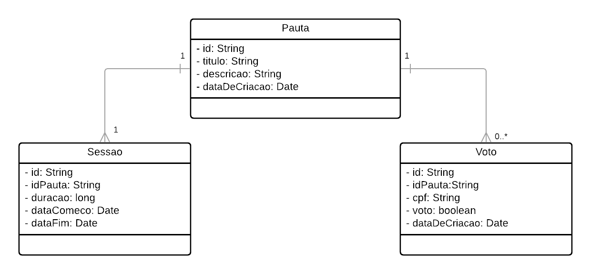
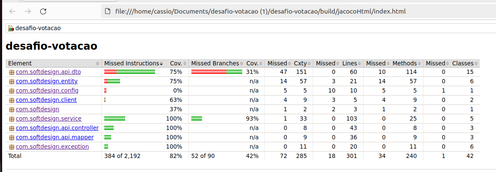

# Desafio Votação

## Tecnologias usadas

- [Java 17](https://www.oracle.com/java/technologies/javase/jdk17-archive-downloads.html)
- [Spring Boot](https://spring.io/projects/spring-boot)
- [MongoDB](https://www.mongodb.com)
- [OpenAPI](https://swagger.io/specification/)
- [Gradle](https://gradle.org/)
- [Docker](https://www.docker.com/)
- [Docker Compose](https://docs.docker.com/reference/cli/docker/compose/)

## Sobre o Desenvolvimento

O desafio foi realizado utilizando Spring Boot, Gradle e MongoDB como banco de dados. Essas ferramentas foram escolhidas devido à familiaridade com as tecnologias, visando um desenvolvimento mais ágil.

### Modelagem de Dados



### Instruções de Uso

A aplicação requer duas dependências para funcionar localmente: um banco de dados MongoDB e um validador de CPF falso (https://github.com/cassiorp/fake-cpf-validator), um serviço que valida aleatoriamente se um CPF é válido ou não. É possível iniciar toda a infraestrutura via Docker Compose. Certifique-se de ter o Docker e o Docker Compose instalados em seu computador.

1. Clone o repositório e navegue até a pasta `docker/app`:
```bash
cd desafio-votacao/docker/app
```

2. Execute o comando:
```bash
docker-compose up
```

Isso instanciará três containers (`desafio-votacao`, `mongo_db` e `cpfvalidator`). O banco de dados criará um volume dentro do diretório `desafio-votacao/docker/mongo-data`, garantindo que os dados persistam entre reinicializações da aplicação. Você pode acessar a documentação da API em http://localhost:5000/swagger-ui/index.html.

Também é possível executar apenas as dependências do projeto e iniciar a aplicação em sua IDE de preferência. Para isso, execute o comando `sudo docker-compose up` dentro do diretório `desafio-votacao/docker/dependencies`.

**Coleção do Postman:** [Link para Download](https://drive.google.com/file/d/1EEcqzN9X0l0DXuLMzuWPrSYPUsfok8Tf/view?usp=sharing)

## API

| Rota                           | Método | Descrição                                                                                                                                                                                                                                                                                                                                        |
|--------------------------------|--------|--------------------------------------------------------------------------------------------------------------------------------------------------------------------------------------------------------------------------------------------------------------------------------------------------------------------------------------------------|
| `/api/v1/pauta`                | POST   | Cria uma nova pauta com título e descrição.                                                                                                                                                                                                                                                                                                      |
| `/api/v1/pauta`                | GET    | Retorna todas as pautas cadastradas.                                                                                                                                                                                                                                                                                                             |
| `/api/v1/pauta/{id}/resultado` | GET    | Retorna o resultado da votação de uma pauta pelo seu ID, incluindo datas de abertura e fechamento da votação, total de votos, votos a favor, votos contra e o campo `status`, indicando se a votação está `ABERTA`, `APROVADA`, `REPROVADA` ou `EMPATADA`.                                                                                       |
| `/api/v1/sessao`               | POST   | Cria uma nova sessão de votação. Requer o campo obrigatório `idPauta` (ID da pauta existente) e o campo opcional `duracao`, que define a duração da votação em milissegundos (padrão: 60000 = 1 minuto).                                                                                                                                         |
| `/api/v1/voto`                 | POST   | Registra um voto. Requer os campos obrigatórios `voto` (booleano), `cpf` (String) e `idPauta` (String). A validação do CPF é realizada aleatoriamente por um serviço externo. Se o formato do CPF for inválido, será retornado sempre `UNABLE_TO_VOTE`. Se for válido, será feita uma votação aleatória entre `ABLE_TO_VOTE` e `UNBALE_TO_VOTE`. |

### Cobertura de testes
